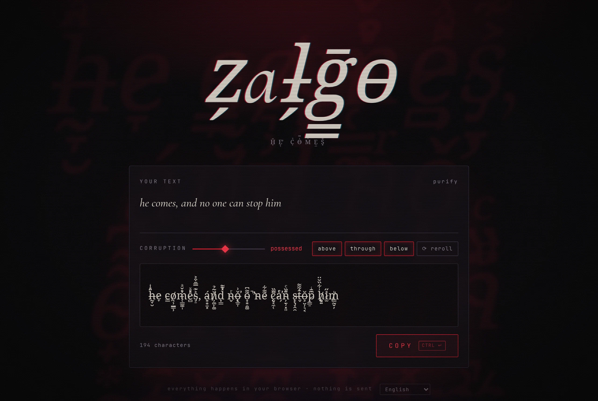

# zalgo

**→ [zalgo.gheop.com](https://zalgo.gheop.com)**

Tape un texte, il se corrompt sous tes yeux, un clic et il est copié. Des diacritiques combinants s'empilent au-dessus, en dessous et en travers de chaque lettre, jusqu'à déborder sur les lignes voisines.

[](https://zalgo.gheop.com)

Tout se passe dans le navigateur : aucun texte n'est envoyé au serveur.

## Utilisation

- Taper le texte, régler la corruption (0 à 100) et les zones touchées : dessus, travers, dessous.
- Cliquer sur le résultat ou sur « copier » (raccourci : Ctrl+Entrée, ⌘+Entrée sur Mac).
- « relancer » (Alt+R) retire les marques au sort. Taper une lettre de plus ne change pas celles déjà corrompues.
- « purifier » nettoie un texte zalgo collé. Une marque seule n'est gardée que si elle forme une lettre accentuée du Latin-1 (é, ç, ñ, û…). Limite : un « û » posé par le zalgo est identique à un « û » tapé et reste en place.

En ligne de commande, `zalgo.py` fait la même chose avec les mêmes listes de marques :

```sh
./zalgo.py -i 3 "il vient"
echo "extraordinaire" | ./zalgo.py -i 1
```

## Héberger sa copie

La page est statique, sans build : n'importe quel serveur de fichiers convient.

```sh
cd web && python3 -m http.server 8000
```

Pour la servir comme en production, avec la compression, le cache long des polices et la politique de sécurité de contenu de `web/nginx.conf` :

```sh
podman run --rm -p 8080:8080 \
  -v "$PWD/web:/usr/share/nginx/html:ro" \
  -v "$PWD/web/nginx.conf:/etc/nginx/conf.d/default.conf:ro" \
  docker.io/nginxinc/nginx-unprivileged:1.29-alpine
```

`docker` remplace `podman` sans autre changement. Le TLS et HSTS sont à ajouter par le proxy placé devant.

## Organisation

- `web/` : la page. `zalgo.js` contient la logique pure (corruption, purification), `app.js` l'interface, `nginx.conf` la config du serveur.
- `web/fonts/` : Cormorant Garamond italique pour le titre, et un sous-ensemble de Noto Serif (latin + marques U+0300 à U+036F) pour le résultat. Sans lui, les polices système de repli dessinent les marques en blocs carrés.
- `zalgo.py` : la version en ligne de commande.
- `tests/` : tests unitaires (JS et Python) et test de bout en bout.
- `bench/` : banc de performance et journal des optimisations (voir `PERF.md`).

## Tests

```sh
npm test                 # unitaires JS (node:test) + Python (unittest), sans dépendance
python3 tests/e2e.py web # bout en bout : vrai nginx (podman) + Chrome headless
```

Le test de bout en bout demande `podman`, Google Chrome et `pip install playwright`. La CI (`.github/workflows/test.yml`) lance les deux.

## Licence

Code sous licence MIT (voir `LICENSE`). Les polices de `web/fonts/` (Cormorant Garamond, Noto Serif) restent sous SIL Open Font License 1.1.

## Changelog

### v1.1.0 — Ambiance visible et page plus sobre (2026-09-24)

- La lueur rouge et l'écho géant du texte s'affichent enfin : un fond mal placé les masquait depuis la v1.0.0
- La page consomme nettement moins au repos : les effets d'ambiance suivent l'horloge du titre (8 images/s au lieu de 60) et le halo du titre n'est plus repeint à chaque tirage
- Suite de tests (unitaires JS et Python, bout en bout) et CI GitHub Actions

### v1.0.1 — Purification plus stricte (2026-09-24)

- « purifier » retire désormais les marques isolées qui ne forment pas une lettre accentuée courante (Ċ, r̃, ṅ disparaissent, é et ç restent)
- Le bouton « purifier » s'allume dès qu'il reste quelque chose à nettoyer, même une seule marque

### v1.0.0 — Page web zalgo.gheop.com (2026-09-24)

- Page web pour corrompre un texte et le copier en un clic
- Réglage de l'intensité et des zones (dessus, travers, dessous), nouveau tirage, purification
- Mise en ligne sur zalgo.gheop.com
